# **1.** 相关技术

## ARKit

ARKit是苹果公司在2017年推出的开发AR应用的框架。ARKit整合 AVFoundation、CoreMotion、 CoreML 3个框架，并在这基础上融合扩展而成。AVFoundation是处理基于时间的多媒体数据框架，CoreMotion是处 理加速度计、陀螺仪、LiDAR等传感数据信息框架，CoreML则是机器 学习框架。ARKit融合来自AVFoundation的视频图像信息与来自 CoreMotion的设备运动传感数据，再借助于CoreML计算机图像处理 与机器学习技术，提供稳定的三维数字环境。

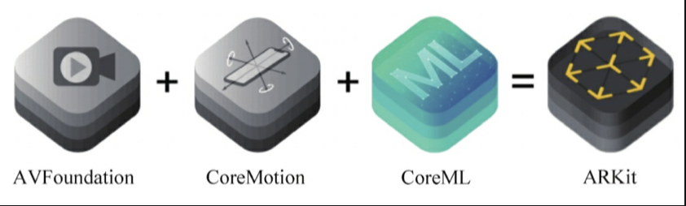

ARKit通过iPad和iPhone的摄像头采集的图像信息（包括LiDAR采集的信息），实现了平面检测识别、场景几何、环境光估计、环境光反射、2D图像识别、3D物体识别、人脸检测、人体动作捕捉等高级功能，在此基础上就能够创建虚实融合的场景。

从代码实现的角度来看，使用ARKit主要包括3部分：ARSession会话、ARAnchor锚点、ARFrame帧。

1. **ARSession**: 管理 AR 应用状态和生命周期的核心组件，是与 ARKit 交互的主要入口。它整合了设备的传感器和摄像头数据，用于在现实世界和虚拟世界之间建立联系。

2. **ARConfiguration类**: 负责配置 AR 功能，决定了如何跟踪设备的运动、使用硬件资源以及可用的功能集。

3. **ARAnchor**: 用于将虚拟对象固定到 AR 空间的特定位置。它通过视觉校准技术保持虚拟对象的位置和方向，从而提供沉浸式的 AR 体验。

4. **ARFrame**: 表示摄像头捕获的一帧图像，同时包含了丰富的 AR 状态信息，如环境光照、WorldMap 状态、检测到的特征点、锚点集合等。


## RealityKit

ARKit并不包含图形渲染API，它只提供设备的跟踪和真实物体表面检测功能。对虚拟物体 的渲染由第三方框架提供，如RealityKit、SceneKit、SpriteKit、 Metal等。SceneKit设计处理3D渲染、SpriteKit设计处理2D渲染、 Metal则是更底层的图形API，设计之初均未考虑AR应用，因此使用这 些框架并非最合适的选择。

RealityKit是完全面向AR开 发的，其重点解决的问题也是现实环境中的虚拟元素PBR渲染及精准的 行为模拟，包括物理仿真、环境反射、环境光估计等。RealityKit专为 真实环境中虚拟元素渲染而设计，所有的特性都围绕营造真实感更强、 代入感更好的AR体验。因此我选用RealityKit作为本项目的图形渲染API。

RealityKit的整体代码开发架构如下图所示：

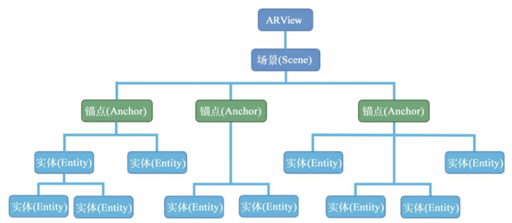


1. **ARView**: 它是 RealityKit 中的核心组件，作为 AR 应用的视图入口，负责渲染场景和处理用户交互。每个 ARView 都包含一个 Scene 类实例，并且可以设置渲染特性、环境检测选项和摄像机渲染模式。

2. **Scene**: 作为放置所有实体对象的容器，Scene 管理着 AR 应用中的所有实体，包括虚拟元素和现实世界的锚点。Scene 实例在创建 ARView 时自动创建，并且可以通过 ARView 的属性访问。

3. **AnchorEntity**: 它是 Scene 中用于将虚拟元素绑定到现实世界特定对象的实体。AnchorEntity 继承自 Entity 类，并遵循 HasAnchoring 协议，使其能够被添加到 Scene 的 anchors 集合中。

4. **Entity**: 是 Scene 的基本组成元素，可以看作是一个容器，通过挂载不同的组件来形成不同的外观和行为。Entity 默认挂载了 TransformComponent 和 SynchronizationComponent 组件，用于描述空间位置信息和数据同步。

下面是一个简单的 ARKit + RealityKit 应用的基础代码框架，用来创建在iPhone上的具有AR功能的页面：

```swift
import RealityKit
import ARKit

class ViewController: UIViewController, ARViewDelegate {
    var arView: ARView!
    
    override func viewDidLoad() {
        super.viewDidLoad()
        
        // 初始化 ARView
        arView = ARView(frame: self.view.frame)
        arView.session = ARSession()
        arView.autoenablesDefaultLighting = true
        arView.delegate = self
        self.view.addSubview(arView)
        
        // 设置 AR 配置
        let configuration = ARWorldTrackingConfiguration()
        arView.session.run(configuration)
        
        // 创建并添加虚拟元素到 Scene
        setupVirtualContent()
    }
    
    func setupVirtualContent() {
        // 创建一个 AnchorEntity 并添加到 Scene
        let anchorEntity = AnchorEntity(plane: .horizontal, minimumBounds: [0.2, 0.2])
        arView.scene.addAnchor(anchorEntity)
        
        // 创建一个虚拟的立方体实体
        let boxEntity = ModelEntity(mesh: .generateBox(extent: 0.1))
        boxEntity.position = [0, 0, 0] // 设置立方体的位置
        
        // 将立方体实体添加到 AnchorEntity
        anchorEntity.addChild(boxEntity)
    }
    
    // ARViewDelegate 方法
    func arView(_ view: ARView, didAdd node: SCNNode, for anchor: ARAnchor) {
        
    }
}
```


## SwiftUI

在前端实现方面，本项目选用了iOS开发新的UI范式——SwiftUI。SwiftUI 和以前用的传统的 UIKit、 AppKit 等相比，采用了声明式编程模型，通过描述界面的状态和外观来构建 UI，减少了繁琐的更新逻辑代码。而 UIKit 是命令式的，需要手动管理视图的生命周期和状态变更。SwiftUI 提供了实时预览和更简洁的状态管理机制（如 `@State`、`@Binding` 等），提高了开发效率和代码的可维护性。同时，SwiftUI 更注重组件化和可复用性，支持跨平台开发。下面从代码实现的角度重点讲述SwiftUI的特色：

#### 声明式编程模型

SwiftUI 采用声明式编程模型，通过描述界面的状态和界面在不同状态下的外观来构建 UI，所以开发时不需要逐步编写界面变更的过程代码。例如：

```swift
struct ContentView: View {
    @State private var isOn = false

    var body: some View {
        Toggle("Switch", isOn: $isOn)
    }
}
```

在上面的代码中，`Toggle` 的状态与 `isOn` 绑定。当 `isOn` 改变时，SwiftUI 会自动更新界面以反映变化。

#### 状态管理

SwiftUI 提供管理视图状态的机制，从而我可以更清晰地分离数据和视图：

- `@State`: 用于管理视图内部的简单状态。
- `@Binding`: 用于父视图和子视图之间的状态共享。
- `@ObservedObject` 和 `@EnvironmentObject`: 用于更复杂的状态管理，通常结合 `ObservableObject` 来使用，支持多个视图共享数据和响应变化。

例如：

```swift
class Model: ObservableObject {
    @Published var value: Int = 0
}

struct ContentView: View {
    @ObservedObject var mode= Model()

    var body: some View {
        Text("Value: \(model.value)")
        Button("Increment") {
            model.value += 1
        }
    }
}
```

#### 视图的组合性

SwiftUI 通过组合基础视图来构建复杂的 UI 组件。每个视图都是 `View` 协议的一个实现，从而可以轻松定义新的自定义视图：

```swift
struct CustomView: View {
    var body: some View {
        VStack {
            Text("Hello, World!")
            Button("Click") {
                print("Button Clicked")
            }
        }
    }
}
```

#### 可复用性和模块化

由于 SwiftUI 强调视图的组合性，开发者可以创建高度可复用和模块化的组件。这不仅有助于代码的维护，还提高了开发效率。开发者可以将常用的界面元素封装成独立的视图组件，并在项目的不同部分重用这些组件。

```swift
struct ReusableButton: View {
    var title: String
    var action: () -> Void

    var body: some View {
        Button(action: action) {
            Text(title)
        }
    }
}

struct ContentView: View {
    var body: some View {
        ReusableButton(title: "Press", action: {
            print("Button Pressed")
        })
    }
}
```

#### 动画与过渡

SwiftUI 的动画是声明式的，我只需要描述动画的目标状态，SwiftUI 会自动处理动画的过渡效果。例如：

```swift
struct AnimatedView: View {
    @State private var scale: CGFloat = 1.0

    var body: some View {
        VStack {
            Button("Animate") {
                withAnimation {
                    scale += 0.5
                }
            }
            .padding()
            .scaleEffect(scale)
        }
    }
}
```

#### 与现有框架的互操作性

SwiftUI 可以与 UIKit 和 AppKit 无缝集成，开发者可以在 UIKit 视图控制器中嵌入 SwiftUI 视图，反之亦然。本项目采用纯 SwiftUI 实现。


## 3D建模

开发AR体验的APP，不可或缺的一环就是高质量的AR内容。AR内容主要通过艺术设计、然后3D建模提供。我使用 Xcode 的内置套件 Reality Composer 来创建、整合、编辑RealityKit内容。

Reality Composer 提供了一个可视化的编辑环境，让开发者或设计师都可以流畅使用。通过拖放操作直接在应用中创建和配置 AR 内容。主要功能如下：

- **场景编辑**：开发者可以在 Reality Composer 中编辑 AR 场景，包括放置 3D 模型、设置物理属性和定义动画。
- **行为和交互**：可以通过内置的行为系统为对象添加交互，定义触发事件（如点击、碰撞等）及其响应行为，无需编写复杂的代码。

本项目的工作流程为：艺术设计（Procreate，PS） –> 3D建模（Blender）–> 转为Apple设备的专有格式USDZ(Reality Composer) –> 导入XCode项目使用。


# **2.** 系统功能需求

## 项目背景

在当今世界飞速发展的大环境下，文化的交流与碰撞愈发频繁，而文化软实力的重要性也日益凸显。中国作为拥有悠久历史的文化古国，在这个过程中扮演着重要角色。习近平总书记指出，中国文化具有深厚的底蕴，需要以现代的方式传承与弘扬，以适应当代社会的需求，并通过广泛的参与形式，将其价值传达给更广泛的受众。

近年来，增强现实（AR）技术的迅猛发展为文化传播提供了全新的可能性。AR技术的应用不仅丰富多样，而且能够为用户带来全新的感官体验，因此在各个领域逐渐崭露头角。随着产品融合的趋势日益加剧，公众对于个性化、交互性、即时性产品的需求也不断增长。在这一背景下，对于传统文化的传承与创新成为一项重要课题。

然而，我发现目前市场上缺乏一款能够充分展示和弘扬中国传统非物质文化遗产的软件，尤其是缺乏结合最新AR技术的作品。即使存在与非物质文化遗产相关的游戏或科普类产品，可仍然存在很多突出问题，突出问题有：模式僵化老旧（如《春之节》）、制作有失水准（如《华夏万象》）、交互复杂难用（如《Mapix》）等。暂未发现一款能够将中国非遗汇聚、创新、发展，并且允许用户创意表达自我，自觉传承经典的软件。

因此，我产生了借助AR技术，重新构想传播优秀传统文化的形式和方法。通过结合中华非物质文化遗产，以创新的方式传承和展示我国优秀文化，结合AR技术，呈现出多样的艺术形式，从而促进文化遗产的活化利用和创新。


## 功能介绍

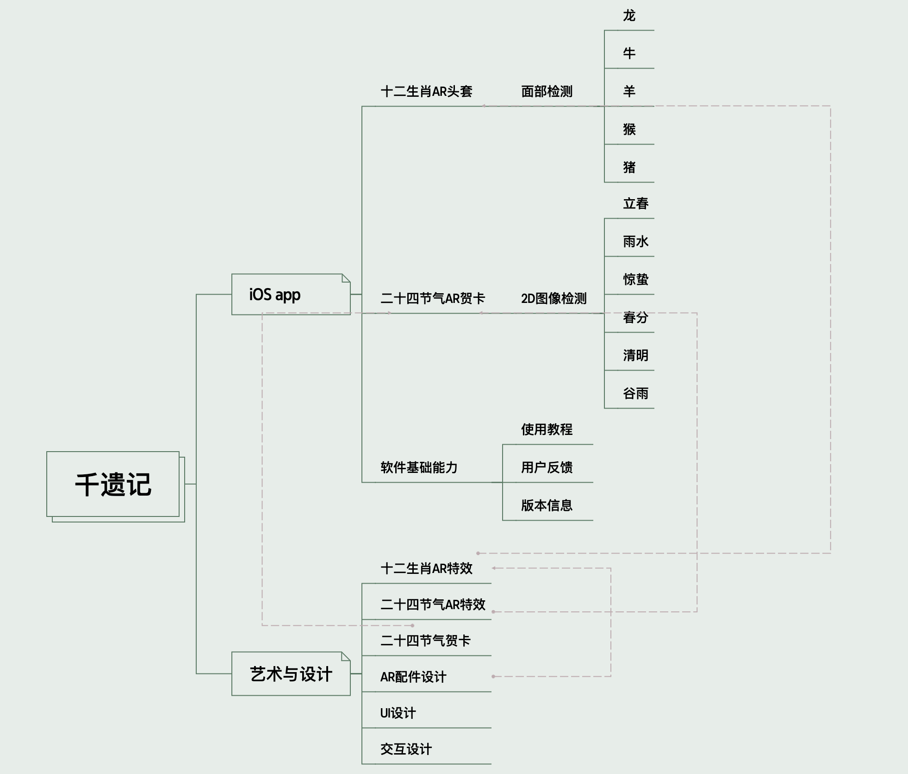

### 功能1: AR生肖面具

本功能设计了5个AR面具，以十二生肖牛、龙、羊、猴、猪为原型制作。针对iOS平台的特性进行了适配与优化。

用户打开对应的页面，前置摄像头的面部识别功能即打开。当面部完整展示在屏幕中、软件捕捉到时，对应的面具就会贴附于用户面部。

用户可以点击底部的相机按钮拍照，自动打开系统分享页面，可以通过各种社交媒体渠道进行分享，也可以保存到本地。


### 功能2:AR节气场景

本功能使用ARKit的图像检测能力。当对应的图像出现在相机中即可将AR特效附着在卡面上。卡片移动时，AR效果会自然地跟随移动。

本功能同样支持照相与分享。

为支持本功能设计了6张以二十四节气为主题的贺卡,对应中国农历 6 个节气:立春、雨水、惊蛰、春分、清明、谷雨。每张贺卡都绘制了典型的中国传统画面和意境,包含了中国传统节气文化内涵。辅以节气特色,用以祈福送祝。贺卡上的小细节都与对应节气相关化用而来。


### 功能3:软件基础能力

和其他上架的软件一样，本软件也支持查看版本信息、提交反馈信息、提供使用教程。

反馈页面可以直接给我的邮箱发邮件。

版本信息页面可以查看软件的版本信息、制作人员等信息。

使用教程页面设计为左右滑动的形式，可以查看逐步的使用教程。


## 软件功能表

| 模块 | 功能名称   | 功能描述                                         |
| ---- | ---------- | ------------------------------------------------ |
| AR   | 查看AR效果 | 用户打开对应页面，使用AR特效。                   |
|      | 选择AR效果 | 用户可以选择希望使用的特效。                     |
|      | 分享截图   | 用户可以将AR页面截图分享至其他应用或保存至本地。 |
| 设置 | 提交反馈   | 用户可以通过发送邮件，告诉开发者自己的想法。     |
|      | 使用教程   | 用户可以了解软件的功能与使用方法。               |
|      | 版本信息   | 用户可以查看当前使用的版本信息、开发者信息。     |


## 用例图

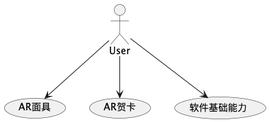


## 系统背景描述

### 运行环境

| 操作系统     | iOS 11及以上                 |
| ------------ | ---------------------------- |
| **硬件平台** | **iPhone，iPad，iPod Touch** |

### 假定和依赖

| 假定     | 使用本软件的设备性能足以支持实时渲染AR场景。                 |
| -------- | ------------------------------------------------------------ |
| **依赖** | **本软件依赖于ARKit、RealityKit运行，因此设备的iOS版本必须支持这两个库。** |


# **3.** 系统设计与实现

## 总体设计

本软件是一款基于iOS平台的增强现实（AR）应用，利用ARKit和RealityKit框架，实现AR生肖面具和AR节气场景两大主要功能。软件设计以用户体验为中心，充分利用iOS设备的硬件性能和操作系统特性，实现高效的面部识别和图像检测功能。系统采用模块化设计，便于功能扩展和维护。

### 系统组成

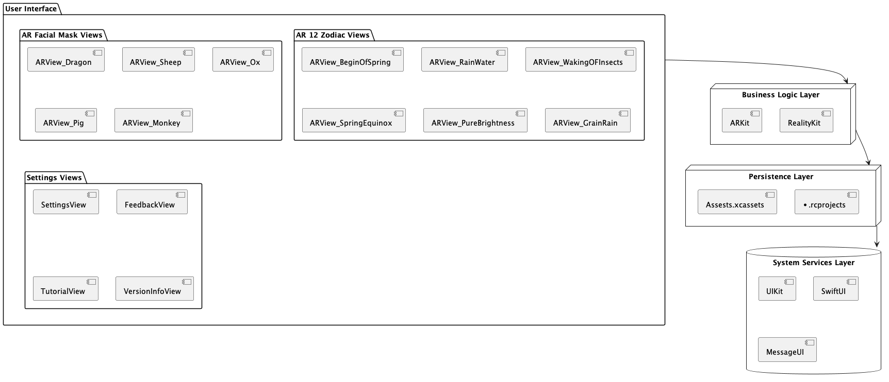

1. **用户界面层（UI Layer）**：
    - 用户界面层提供了与用户直接交互的部分。它们用于接收用户的输入并显示系统的反馈信息。包含各个功能页面、相机拍照按钮、分享按钮、版本信息页面、反馈页面和使用教程页面。

    - 选择将用户界面层独立出来，使得界面设计和业务逻辑解耦，方便前端和后端的分工合作。
    
    - 运行机制：用户在界面层进行操作，这些操作会通过函数调用发送到业务逻辑层。
    
2. **业务逻辑层（Business Logic Layer）**：
    - 负责处理核心业务逻辑。把业务逻辑层独立出来，专注于业务规则和逻辑处理，使系统具有良好的可维护性和扩展性。
    - 运行机制：接收到用户界面控制器发来的请求后，依据业务规则处理请求，并生成响应数据。
    - 包括面部识别、图像检测、AR效果生成和管理、照片拍摄与分享功能等。
    - 因为本项目面向普通用户，没有太多的业务交互接口，所以不单独安排控制器层、使用用户界面控制器。
    
3. **持久化层（Persistence Layer）**：
   
    - 主要用于存储和管理软件的静态资源和动态数据，包括AR面具模型、节气贺卡图像、用户反馈信息等。
    - 持久化层将数据存储与业务逻辑分离，增强了数据管理的灵活性和可靠性。
    
4. **系统服务层（System Services Layer）**：
   
    - 负责与iOS系统服务进行交互，包括调用相机、访问相册、发送邮件、调用分享接口等。


### 用户界面层

####  **总体设计原则**

#####  **可用性**

确保本系统对用户来说易于学习、易于操作，并且能够满足使用需求。在千遗记的界面设计中，我考虑了以下几个方面：

- 易学性：界面应该简单直观，用户能够迅速理解和掌握系统的操作方式。

- 易操作性：界面元素的布局和交互应该符合用户的直觉和习惯，减少用户错误操作的可能性。

- 反馈机制：系统应该提供及时的反馈，例如成功提示、错误提示等，让用户了解他们的操作是否成功或失败。


##### **一致性**

千遗记各个界面的设计在整体风格、交互方式和视觉元素上力求保持一致性，使用户能够轻松地在不同页面和模块之间进行切换和操作。具体考虑如下：

- 风格一致性：界面应该使用相同的颜色、字体、图标等视觉元素，保持整体风格的统一。

- 布局一致性：各个页面的布局和模块位置应该保持一致，使用户能够快速熟悉和操作。

- 交互一致性：相似功能模块的交互方式应该保持一致，例如使用相同的按钮样式、输入框等，以减少用户的认知负担。

- 表达一致性：系统中使用的术语、标签和描述应该保持一致，避免不同页面或模块之间的混淆和歧义。


##### 可扩展性

可扩展性指的是界面设计能够适应系统未来的扩展和变化，以满足不断变化的需求和功能增加的要求。因为本项目目前处于早期开发阶段，在未来的发展过程中可能会做出较多较大的扩展。因此从以下几个方面考虑可扩展性：

- 模块化设计：将界面划分为独立的模块，便于新增功能或扩展现有功能。

- 扩展接口：设计支持扩展接口，允许第三方开发人员进行定制开发和集成其他系统。

- 数据展示灵活性：设计数据展示的方式应该灵活，能够适应不同数据类型和不同展示需求。


#### **整体设计规范**

- 各页面均采用模块化的设计，统一设计语言。
- 软件组件以中国传统元素祥云、秋月为灵感进行设计。背景通过祥云的衬托，更具中国传统韵味。

字体规范：

中西文字体均选用"PingFang SC"。

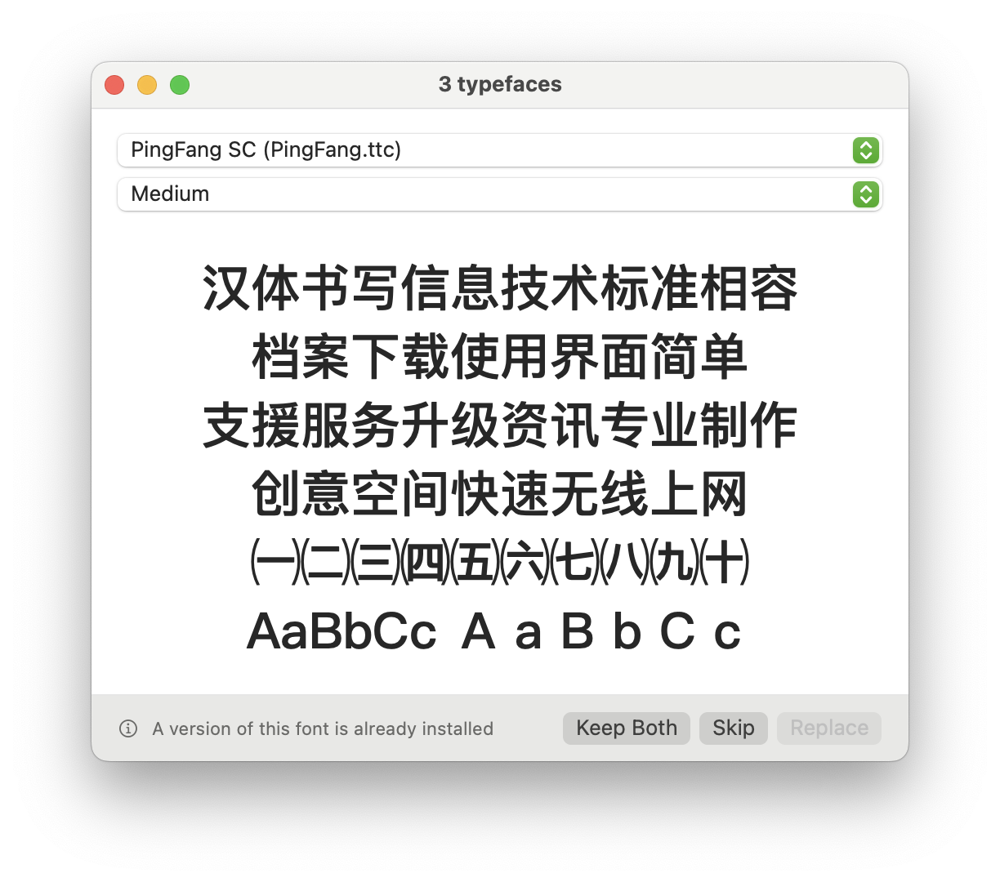

字号规范：

代码中直接选择预置的.heading .body .subheading等自适应字号，能够根据用户设定的字体大小、设备型号动态调整，所以不显式指定。

内容规范：

- 为降低用户使用成本，前端尽量避免出现程序员专有名词。

- 良好正确显示的报错信息，确保能够引导用户的下一步操作而非误导理解。


图片规范：

均存放于Xcode项目的Assets.xcassets中，分包管理。

#### 分页面说明

前端代码实现通过SwiftUI实现，其中需要精细控制的地方用UIKit做了进一步的调整。整体都是模块化的设计，代码最外层为视图结构体，内层ZStack的底层放置背景图，图片设置为忽略安全边框、自适应大小，从而填满整个屏幕。功能在ZStack的内部继续堆叠。

1. **主界面（Main Interface）**：

    - 包含进入AR生肖面具功能页面、AR节气场景功能页面的按钮和设置页面的按钮。

    - 右上角放置软件logo。

      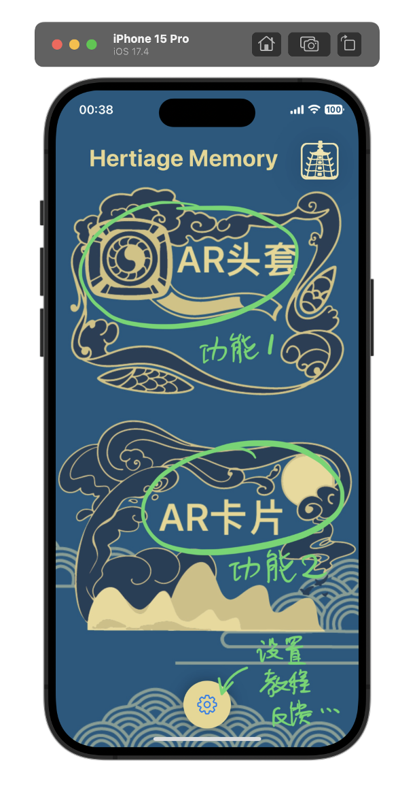

1. **内容选择页面（Content Choice Page）：**

    - 包含特效的选择按钮。

    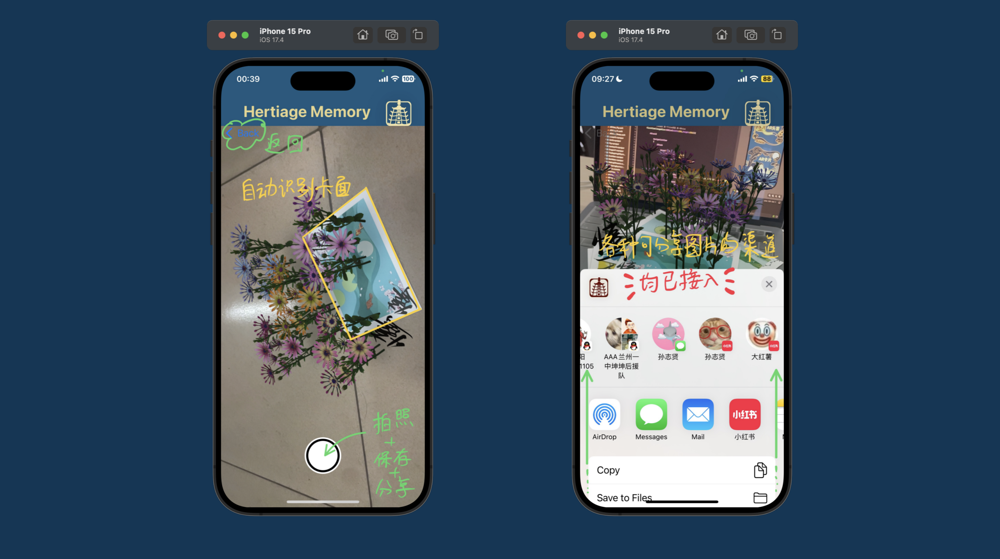

3. **AR节气场景页面（AR SeasonaScenes Page）**：

    - 实时显示相机视图，检测到特定节气卡片时叠加AR特效，底部有拍照按钮。
    - 点击拍照后，可以分享至其他APP

    
    


4. **AR生肖面具页面（AR Zodiac Mask Page）**：

- 前置摄像头显示用户面部，底部有拍照按钮，左上角有返回按钮。
- 实现原理和节气场景一致。

    
    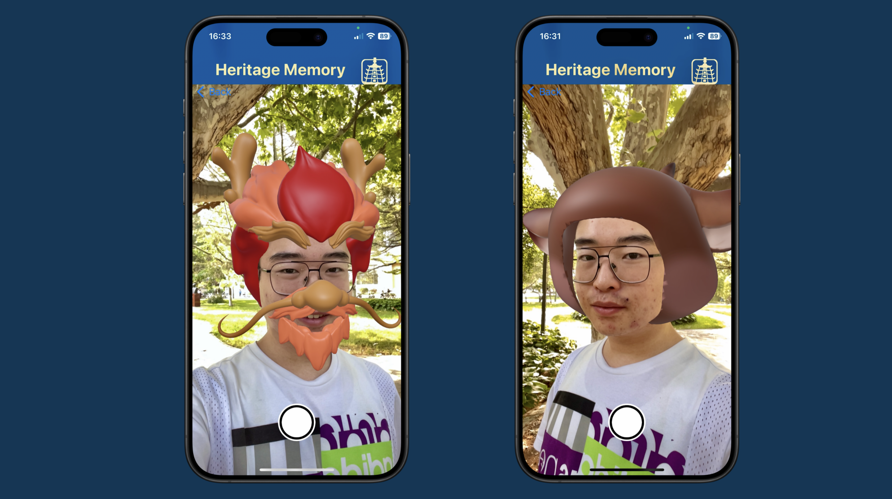

5. **版本信息页面（Version Info Page）**：

    - 显示软件版本号、开发者信息等。
    - 在ZStack底层设置背景图
    - 通过VStack和Text()实现内容。


6. **反馈页面（Feedback Page）**：
    - 提供用户发送反馈邮件的入口。将邮件的目的邮箱、主题、正文开头都提前预置，方便用户直接编写遇到的问题或建议想法、并且直接发到我的邮箱中。

    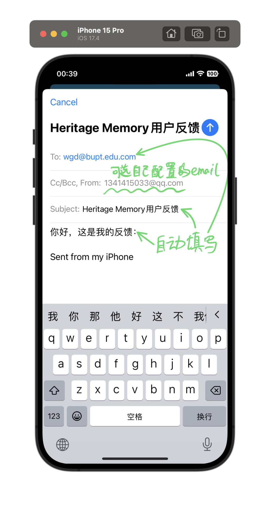

7. **使用教程页面（TutorialPage）**：
   
    - 左右滑动查看各功能使用步骤和说明。
    - 使用TabView实现左右滑动效果。
    
    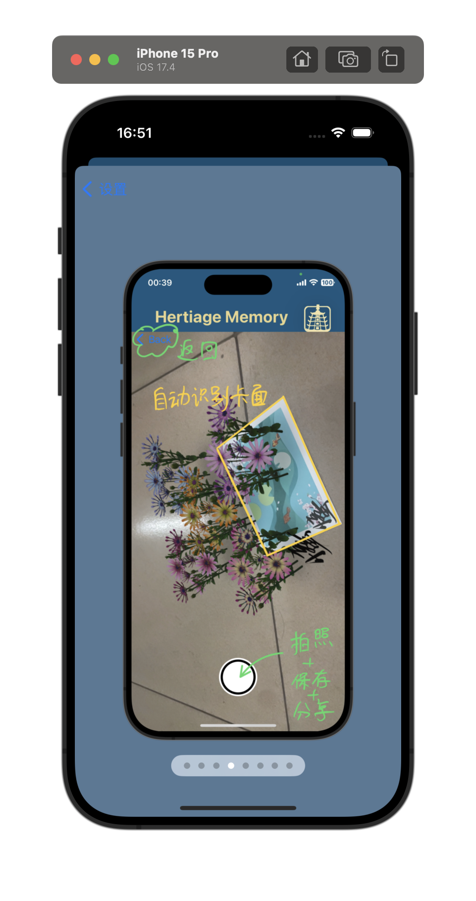

### 业务逻辑层

1. **面部识别模块（Face Recognition Module）**：
    - 使用ARKit提供的面部追踪功能，实时捕捉用户面部并叠加AR面具。
    
    ```swift
    import ARKit
    
    class FaceTrackingViewController: UIViewController, ARSessionDelegate {
        var arView: ARSCNView!
    
        override func viewDidLoad() {
            super.viewDidLoad()
            setupARView()
            startFaceTracking()
        }
    
        func setupARView() {
            arView = ARSCNView(frame: self.view.frame)
            self.view.addSubview(arView)
            arView.delegate = self
            arView.session.delegate = self
        }
    
        func startFaceTracking() {
            let configuration = ARFaceTrackingConfiguration()
            arView.session.run(configuration, options: [.resetTracking, .removeExistingAnchors])
        }
    
        func session(_ session: ARSession, didUpdate anchors: [ARAnchor]) {
            for anchor in anchors {
                if let faceAnchor = anchor as? ARFaceAnchor {
                    updateFaceOverlay(with: faceAnchor)
                }
            }
        }
    
        func updateFaceOverlay(with faceAnchor: ARFaceAnchor) {
            // 根据faceAnchor数据更新AR面具
        }
    }
    ```
2. **图像检测模块（Image Detection Module）**：
    - 利用ARKit的图像检测功能，识别特定节气贺卡并生成对应的AR特效。
    
    ```swift
    import ARKit
    
    class ImageDetectionViewController: UIViewController, ARSessionDelegate {
        var arView: ARSCNView!
    
        override func viewDidLoad() {
            super.viewDidLoad()
            setupARView()
            startImageDetection()
        }
    
        func setupARView() {
            arView = ARSCNView(frame: self.view.frame)
            self.view.addSubview(arView)
            arView.delegate = self
            arView.session.delegate = self
        }
    
        func startImageDetection() {
            guard let referenceImages = ARReferenceImage.referenceImages(inGroupNamed: "SeasonalCards", bundle: nil) else {
                return
            }
            let configuration = ARWorldTrackingConfiguration()
            configuration.detectionImages = referenceImages
            arView.session.run(configuration, options: [.resetTracking, .removeExistingAnchors])
        }
    
        func session(_ session: ARSession, didAdd anchors: [ARAnchor]) {
            for anchor in anchors {
                if let imageAnchor = anchor as? ARImageAnchor {
                    displayARContent(for: imageAnchor)
                }
            }
        }
    
        func displayARContent(for imageAnchor: ARImageAnchor) {
            // 根据imageAnchor数据展示AR特效
        }
    }
    ```
3. **AR效果管理模块（AR Effect Management Module）**：
    - 管理和渲染各类AR效果，包括面具和节气特效，确保效果跟随用户或贺卡移动。
4. **照片处理模块（Photo Processing Module）**：
    - 处理用户拍照请求，保存照片并调用系统分享功能。
    
    ```swift
    import UIKit
    
    class PhotoCaptureManager {
        func capturePhoto(from view: UIView, completion: @escaping (UIImage?) -> Void) {
            UIGraphicsBeginImageContextWithOptions(view.bounds.size, false, UIScreen.main.scale)
            view.drawHierarchy(in: view.bounds, afterScreenUpdates: true)
            let image = UIGraphicsGetImageFromCurrentImageContext()
            UIGraphicsEndImageContext()
            completion(image)
        }
        
        func sharePhoto(_ photo: UIImage, from viewController: UIViewController) {
            let activityVC = UIActivityViewController(activityItems: [photo], applicationActivities: nil)
            viewController.present(activityVC, animated: true, completion: nil)
        }
    }
    ```

### 持久化层

1. **资源管理模块（Resource Management Module）**：
    - 管理应用所需的静态资源，如图标、AR面具模型、节气贺卡图像等。
    - 本项目使用`Assets.xcassets`集中管理。
    
2. **用户数据模块（User Data Module）**：
    - 存储用户拍摄的照片和反馈信息。
    - 交由操作系统管理，存储到相册或文件APP中，不在本软件内保存。

### 系统服务层

1. **相机服务模块（Camera Service Module）**：
    - 调用iOS系统相机，捕捉实时视频流用于面部识别和图像检测。

2. **分享服务模块（Share Service Module）**：
   
    - 调用系统分享接口，支持用户通过社交媒体分享拍摄的照片。
    
    ```swift
    import SwiftUI
    
    class ShareService {
        
        // 单例模式
        static let shared = ShareService()
        
        private init() {}
        
        // 方法：分享图片
        func sharePhoto(_ photo: UIImage, from viewController: UIViewController) {
            let activityVC = UIActivityViewController(activityItems: [photo], applicationActivities: nil)
            
            viewController.present(activityVC, animated: true, completion: nil)
        }
    }
    ```
    
3. **邮件服务模块（EmaiService Module）**：
    - 通过系统邮件功能发送用户反馈邮件。
    
    ```swift
    import SwiftUI
    import MessageUI
    
    class EmailService: NSObject, MFMailComposeViewControllerDelegate {
        
        // 单例模式
        static let shared = EmailService()
        
        private override init() {}
        
        // 方法：发送邮件
        func sendFeedbackEmail(from viewController: UIViewController, to recipient: String) {
            guard MFMailComposeViewController.canSendMail() else {
                // 处理设备不支持发送邮件的情况
                showMailErrorAlert(from: viewController)
                return
            }
            
            let mailComposeVC = MFMailComposeViewController()
            mailComposeVC.mailComposeDelegate = self
            mailComposeVC.setToRecipients([recipient])
            mailComposeVC.setSubject("Heritage Memory用户反馈")
            mailComposeVC.setMessageBody("你好，这是我的反馈：", isHTML: false)
            
            viewController.present(mailComposeVC, animated: true, completion: nil)
        }
        
        // 邮件发送结果处理
        func mailComposeController(_ controller: MFMailComposeViewController, didFinishWith result: MFMailComposeResult, error: Error?) {
            controller.dismiss(animated: true, completion: nil)
            
            // 可以在这里处理邮件发送结果，如显示提示信息等
        }
        
        // 显示错误提示
        private func showMailErrorAlert(from viewController: UIViewController) {
            let alert = UIAlertController(title: "无法发送邮件", message: "设备不支持发送邮件，请检查邮件设置并重试。", preferredStyle: .alert)
            alert.addAction(UIAlertAction(title: "确定", style: .default, handler: nil))
            viewController.present(alert, animated: true, completion: nil)
        }
    }
    ```


## 关键代码解释

### ContentView

`ContentView.swift` 文件定义了 Heritage Memory 应用的主界面布局和交互逻辑。我使用 SwiftUI 框架来构建用户界面，并通过多个 `@State` 属性管理视图状态。具体功能包括导航至不同的 AR 视图和显示设置界面。

其中，`ContentView` 结构体包含一个 `body` 计算属性，该属性定义了主界面的所有 UI 元素和布局。主视图使用 `NavigationView` 包裹主要的界面结构，支持视图导航。 `ZStack` 叠加不同层次的视图，底层是背景图像，中间层是 AR 功能按钮，上层是设置按钮。 `VStack` 用于垂直排列 AR 功能按钮。

```swift
struct ContentView: View {
    @State private var isPresented = false
    @State private var showSettings = false // State variable to show settings view

    // 结构体定义新类型
    var body: some View {
        
        // 计算属性 是一个view类型 某一种view
        FirstView(imageSize:CGSize(width:256,height:256)){
            
            HStack{
                
                NavigationView {
                    ZStack {
                        Image("2")
                            .padding(.top, 518.0)
                            .frame(height: 755.0)
                            .background(Color("background"))

                        VStack {
                            ZStack {
                                ...
                                }
                            }
                                
                            ZStack {
                                ...
                                }
                            }
                        }
                        VStack {
                            Spacer()
                            HStack {
                              		...
                            }
                        }
                    }
                    .navigationTitle(" ")
                                .sheet(isPresented: $showSettings) {
                                    SettingsView()
                                }
                }
            }
        }
    }
}
```

每个 AR 功能按钮使用 `NavigationLink` 控件实现导航，点击时导航至对应的 AR 视图。每个按钮使用 `ZStack` 叠加图像和文字，确保视觉效果一致。设置按钮位于界面右下角，点击时触发 `showSettings` 状态变化，通过 `.sheet` 方法呈现 `SettingsView`，响应 `showSettings` 状态变化。

```js
NavigationLink( destination : ARcameraView(preView: self), isActive: $isPresented) {
    ZStack{
        Image("资源 2")
            .frame(width: /*@START_MENU_TOKEN@*/500.0/*@END_MENU_TOKEN@*/, height: /*@START_MENU_TOKEN@*/250.0/*@END_MENU_TOKEN@*/)
            .scaleEffect(2.2)
            .offset(x:0,y:-70)
        Text("AR头套")
            .font(.headline)
            .foregroundColor(Color("gold2"))
            .scaleEffect(2.5)
            .offset(x: 40, y: -110)
    }
}

NavigationLink( destination : ARCardView(preView: self)) {
    ZStack {
        Image("资源 3")
            .frame(width: /*@START_MENU_TOKEN@*/500.0/*@END_MENU_TOKEN@*/, height: /*@START_MENU_TOKEN@*/250.0/*@END_MENU_TOKEN@*/)
            .scaleEffect(2.1)
            .offset(x:0,y:-30)
        Text("AR卡片")
            .font(.headline)
            .foregroundColor(Color("gold2"))

            .scaleEffect(2.6)
            .offset(x: 20, y: -40)
    }
}

Button(action: {
    showSettings = true
}) {
    Image(systemName: "gearshape")
        .imageScale(.large)
        .padding()
        .background(Color("gold2"))
        .clipShape(Circle())
        .shadow(radius: 10)
}
.padding()
```

`FirstView` 是一个自定义的容器视图，接收三个闭包用于设置标题视图、徽标视图和导航按钮。

`titleView` 显示应用标题， `logoView` 显示应用徽标， `navButtons` 用于显示导航按钮。

```swift
titleView:{

    Text("Heritage Memory")
        .font(.title)
        .fontWeight(.bold)
        .foregroundColor(Color("gold2"))
        .scaleEffect(1)


}logoView:{

    Image("appcon")
        .resizable()
        .aspectRatio(contentMode: .fit)
        .shadow(radius: 20)


} navButtons:{
    Button{
        ...
    }label:{
        Image("资源 2")
            .scaleEffect(2.2)
        Text("AR头套")
            .font(.headline)
            .foregroundColor(Color("gold2"))
            .padding([.top, .leading, .bottom], 30.0)
            .scaleEffect(2.5)
            .offset(x: -120, y: -40)
            .shadow(radius: /*@START_MENU_TOKEN@*/10/*@END_MENU_TOKEN@*/)
    }
}
```

 `ContentView_Previews` 结构体用于 Xcode 预览，创建 `ContentView` 实例以便在设计时实时查看效果。

```swift
struct ContentView_Previews: PreviewProvider {
    //    遵循一个可以制作出画布的协议
    static var previews: some View {
        //        静态计算属性
        ContentView()
        //        contentview 实例化
    }
}
```

### FirstView

`FirstView` 结构体是一个泛型视图，它使用 `@ViewBuilder` 注解的闭包来初始化和配置其子视图。初始化方法接收四个闭包和一个 `CGSize` 类型的参数，用于配置子视图和徽标视图的大小。视图的主体部分通过 `VStack` 和 `ZStack` 进行布局，`VStack` 垂直排列子视图，`ZStack` 叠加不同层次的视图。

主视图的布局包括背景颜色、标题视图、徽标视图和主要内容视图。在视图出现时，通过 `onAppear` 修饰符触发一系列动画。文本动画和徽标动画通过 `withAnimation` 和 `DispatchQueue.main.asyncAfter` 实现，徽标视图的大小和位置在动画中动态变化。

徽标视图使用 `matchedGeometryEffect` 关联不同状态下的视图位置和大小变化，以实现平滑的过渡效果。导航按钮通过 `showNavButtons` 状态控制其显示与隐藏。

`FirstView_Previews` 结构体用于 Xcode 预览，创建 `ContentView` 实例以便在设计时实时查看效果。

### 动画

`FirstView` 提供了一个统一的布局和动画框架，而 `ContentView` 则定义了具体的内容：`ContentView` 使用了 `FirstView` 作为其主要布局容器，利用 `FirstView` 提供的插槽来定义应用的标题、徽标、主要内容和导航按钮。

我在`FirstView`中实现了开屏动画，整个过程通过状态管理和动画延迟实现流畅的过渡效果。首先，使用 `@State` 属性管理动画状态： `textAnimation`、`imageAnimation`、`endAnimation` 和 `showNavButtons`。当视图出现时，通过 `onAppear` 修饰符触发动画逻辑。延迟 0.4 秒后，使用 `withAnimation` 改变 `textAnimation` 状态，使标题视图位置平滑过渡。紧接着，使用 `Animation.interactiveSpring` 改变 `endAnimation` 状态，使徽标视图从大到小平滑过渡到新位置。再延迟 0.35 秒，通过 `withAnimation` 改变 `showNavButtons` 状态，显示导航按钮。

`ARcameraView.swift` 文件定义了 Heritage Memory 应用中的 `ARcameraView` 视图，该视图通过 SwiftUI 显示一组 AR 导航链接。每个导航链接对应不同的 AR 视图，用户可以通过点击图像导航到不同的 AR 场景。

和前面一样，使用 `ZStack` 进行层叠布局，背景图片位于底层，导航按钮位于上层。顶部使用 `VStack` 包含背景图片，图片从顶部开始有一定的内边距，并设置背景颜色。使用 `NavigationLink` 实现导航，每个链接内嵌一个图像，并设置 `frame` 和 `scaleEffect` 以确保图像显示合适大小。导航链接放置在不同的 `HStack` 中，使它们在视图中水平排列。

```swift
var body: some View {

    ZStack {
        VStack {
            Image("cloud_layer")
                .padding(.top, 520.0)
                .frame(height: nil)
                .background(Color("background"))
        }
        VStack{
            HStack {
                NavigationLink(destination: ARView04()) {
                    Image("Dragon_v2")
                        .frame(width: 200.0, height: 200.0)
                        .scaleEffect(0.105)
                }
   
             		NavigationLink(destination: ARView_Sheep()) {
                    Image("Sheep_v1")
                        .frame(width: 200.0, height: 200.0)
                        .scaleEffect(0.105)
                }
            }
            HStack {
                ...
            }
            HStack {
                ...
            }
        }
    }
}
```

### ARView

以"惊蛰"AR视图`ARView_WakingOfInsects.swift`为例，概述实现方法：实现这一个AR视图主要包含两个视图结构：`ARView_WakingOfInsects` 和 `ARViewContainer_WakingOfInsects`。

**`ARView_WakingOfInsects` 视图**：

- 使用 `ZStack` 进行层叠布局，将 `ARViewContainer_WakingOfInsects` 作为背景视图，覆盖整个屏幕。

```swift
struct ARView_WakingOfInsects : View {
    @State private var showingSAlert = false
    var body: some View {
        ZStack{
            ARViewContainer_WakingOfInsects().edgesIgnoringSafeArea(.all)
            ...
        }
```

- 使用 `VStack` 布局将截图分享按钮放置在视图的底部。

```swift
VStack {
    Spacer()
    Button(action: {
        takeScreenshotAndShare()
    }) {
        Circle()
            .fill(Color.white)
            .frame(width: 70, height: 70)
            .overlay(
                Circle()
                    .stroke(Color.black, lineWidth: 4)
                    .frame(width: 60, height: 60)
            )
    }
    .padding(.bottom, 30)
    .alert(isPresented: $showingSAlert) {
        Alert(title: Text("无法打开分享页面"), message: Text("请在您的设备上检查分享设置"), dismissButton: .default(Text("确定")))
    }
}
```

- 按钮点击时触发 `takeScreenshotAndShare` 函数，该函数负责截图并打开分享界面。

```swift
func takeScreenshotAndShare() {
    guard let window = UIApplication.shared.windows.first else { return }

    if let rootViewController = window.rootViewController {
        let arView = findARView(in: rootViewController.view)

        if let arView = arView {
            let renderer = UIGraphicsImageRenderer(size: arView.bounds.size)
            let image = renderer.image { ctx in
                arView.drawHierarchy(in: arView.bounds, afterScreenUpdates: true)
            }

            let activityVC = UIActivityViewController(activityItems: [image], applicationActivities: nil)
            rootViewController.present(activityVC, animated: true, completion: nil)
        }
    }
}
```

- `takeScreenshotAndShare` 函数通过 `UIApplication` 获取当前窗口和根视图控制器，在 AR 视图上进行截图。截图后，使用 `UIActivityViewController` 弹出分享选项。

- `findARView` 函数递归搜索视图层次结构，找到 `ARView` 实例。

```swift
func findARView(in view: UIView) -> ARView? {
    if let arView = view as? ARView {
        return arView
    }
    for subview in view.subviews {
        if let found = findARView(in: subview) {
            return found
        }
    }
    self.showingSAlert = true
    return nil
}
```

**`ARViewContainer_WakingOfInsects` 视图**：

- 遵循 `UIViewRepresentable` 协议，实现 `makeUIView` 和 `updateUIView` 方法。

- `makeUIView` 方法创建并返回一个 `ARView` 实例。

```swift
func makeUIView(context: Context) -> ARView {

    let arView = ARView(frame: .zero)

    // Load the "Box" scene from the "Experience" Reality File
    let sceneOneAnchor = try! WakingOfInsects.load场景()

    // Add the box anchor to the scene
    arView.scene.anchors.append(sceneOneAnchor)

    return arView

}
```

- 加载"WakingOfInsects"场景，并将其添加到 `ARView` 的场景中。

- `updateUIView` 方法为空，实现协议要求。

```swift
func updateUIView(_ uiView: ARView, context: Context) {}
```

### FeedbackView

`FeedbackView.swift`主要包含两个视图结构：`FeedbackView` 和 `MailView`。

**`FeedbackView` 视图**：

- 使用 `ZStack` 将背景图像和主内容叠加。

- `VStack` 用于垂直布局，包括一个标题和一个按钮。

```swift
Button(action: {
    if MFMailComposeViewController.canSendMail() {
        self.isShowingMailView = true
    } else {
        self.alertNoMail = true
    }
}) {
    Text("用户反馈")
        .padding()
        .font(.title)
}
```

- 按钮点击后，使用 `MFMailComposeViewController.canSendMail()` 检查设备是否能发送邮件：
- 如果可以发送邮件，则切换 `isShowingMailView` 状态以显示 `MailView`。
- 如果不能发送邮件，则设置 `alertNoMail` 状态以弹出警告提示。

- 使用 `.sheet` 修饰符显示 `MailView`。

```swift
.sheet(isPresented: $isShowingMailView) {
    MailView(isShowing: self.$isShowingMailView)
}
```

- 使用 `.alert` 修饰符显示无法发送邮件的警告。

```swift
.alert(isPresented: $alertNoMail) {
    Alert(title: Text("无法发送邮件"), message: Text("请在您的设备上设置邮件帐户再重试。"), dismissButton: .default(Text("确定")))
}
```

### MailView

- 遵循 `UIViewControllerRepresentable` 协议，实现 `makeUIViewController` 和 `updateUIViewController` 方法。

- `makeUIViewController` 方法创建并配置 `MFMailComposeViewController`，包括设置收件人、邮件主题和邮件正文。

```swift
func makeUIViewController(context: UIViewControllerRepresentableContext<MailView>) -> MFMailComposeViewController {
    let vc = MFMailComposeViewController()
    vc.mailComposeDelegate = context.coordinator
    vc.setToRecipients(["wgd@bupt.edu.cn"])
    vc.setSubject("Heritage Memory用户反馈")
    vc.setMessageBody("你好，这是我的反馈：", isHTML: false)
    return vc
}
```

- `Coordinator` 类实现 `MFMailComposeViewControllerDelegate` 协议，处理邮件撰写界面的关闭事件，并将 `isShowing` 绑定值设置为 `false`。

```swift
class Coordinator: NSObject, MFMailComposeViewControllerDelegate {
    @Binding var isShowing: Bool

    init(isShowing: Binding<Bool>) {
        _isShowing = isShowing
    }

    func mailComposeController(_ controller: MFMailComposeViewController, didFinishWith result: MFMailComposeResult, error: Error?) {
        isShowing = false
    }
}
```

- `makeCoordinator` 方法创建并返回 `Coordinator` 实例。

```swift
func makeCoordinator() -> Coordinator {
    return Coordinator(isShowing: $isShowing)
}
```

### TutorialView

- `TutorialView` 通过 `GeometryReader` 获取设备屏幕尺寸，然后使用 `ZStack` 和 `VStack` 组织布局。

```swift
struct TutorialView: View {    
    var body: some View {
        GeometryReader { geometry in
            ZStack {
                ...
                VStack {
                    ...
                }
            }
        }
    }
}
```

- 背景色使用 `Color` 视图设置为APP背景色并带有一定透明度，为了不和上层的截图冲突，并且使其覆盖整个屏幕。

```swift
Color(red: 0.1725, green: 0.3412, blue: 0.4863, opacity: 0.8) // 使用纯色背景
                    .edgesIgnoringSafeArea(.all)
```

- 主要内容是一个 `TabView`，用于展示一组教程图片，并附加了页面指示器。每个图片视图都使用 `resizable()` 和 `scaledToFit()` 方法确保在不同屏幕尺寸下的良好显示效果。通过 `Spacer` 确保页面指示器始终位于屏幕可视区域内。

```swift
let images: [String]

Spacer().frame(height: geometry.size.height * 0) // 将顶部边距设置为屏幕高度的一小部分
TabView {
    ForEach(images, id: \.self) { imageName in
        Image(imageName)
            .resizable()
            .scaledToFit()
    }
}
.tabViewStyle(PageTabViewStyle())
.indexViewStyle(PageIndexViewStyle(backgroundDisplayMode: .always))
.frame(height: UIScreen.main.bounds.height * 0.75) // 限制TabView高度
Spacer() // 确保indexView在屏幕内
```

- 通过 `TutorialView_Previews` 结构体在预览中展示示例数据，方便开发过程中快速查看效果。

```swift
struct TutorialView_Previews: PreviewProvider {
    static var previews: some View {
        TutorialView(images: ["tut_mainPage", "tut_chooseHead", "tut_chooseCard", "tut_ARCard","tut_share", "tut_settings", "tut_feedback", "tut_about"])
    }
}
```


# **4.** 系统可能的扩展

当前系统开发处于非常初期的阶段，所以在各个层面都具有很大的拓展空间。从AR创意方面和软件基础能力角度来看，目前我希望进一步完善的功能如下：

##  AR创意方面的拓展

1. **AR面具互动功能**：
   - **面具动画**：为面具添加动画效果，如眨眼和变换表情，使面具更加生动。
   - **手势识别**：为基础操作添加手势识别功能，如滑动切换面具或贺卡，双击放大或缩小。
   - **AR绘画**：用户可以在虚拟空间中进行绘画创作，保存并展示自己的AR艺术作品。
2. **AR贺卡互动功能**：
   - **动态贺卡**：添加动态元素，如烟花和气球，用户点击贺卡时会触发这些动画效果。
   - **语音祝福**：用户可以录制自己的语音祝福，并附加到AR贺卡中，并发送给其他用户；收到贺卡的人观看AR场景时可以听到祝福语。
   - **个性化定制**：允许用户自定义贺卡AR场景中的内容，如添加照片、文字。
   - **AR绘画**：用户可以在虚拟空间中进行绘画创作，保存并展示自己的AR艺术作品。
3. **多用户互动**：
   - **多人AR体验**：实现多人同时使用同一个AR场景，如一起佩戴虚拟面具拍照或共同参与AR贺卡互动。
   - **好友赠送**：用户可以通过APP给好友发送AR面具或AR贺卡，让好友也能体验这些有趣的功能。
4. **增强现实滤镜**：
   - **特殊滤镜**：为面具和贺卡场景添加特殊滤镜效果，如拍立得、漫画和梵高的风格，让用户体验不同风格的视觉效果。
   - **季节滤镜**：根据不同的季节自动应用不同的滤镜效果，如冬季的雪花滤镜和夏季的清凉风格滤镜。

## 应用基础能力层面的拓展

1. **用户界面优化**：
   - **响应式设计**：适配不同尺寸的屏幕，确保在iPhone和iPad上都能有良好的使用体验。目前主要考虑了iPhone的屏幕，虽然能够在iPad上运行，但是背景图片、页面布局等存在不协调、拉伸变形的问题。
   - **简单动画效果**：为界面切换和按钮点击添加一些简单的动画效果，让APP更流畅与酷炫。
2. **数据管理**：后期软件增加用户个性化资源后，可以再考虑增加用户注册、登录、存储的需求。
   - **本地存储**：允许用户保存面具或贺卡的个性化设置，并能在下次使用时恢复。
   - **云同步**：提供云端同步功能，用户可以在不同设备间同步数据。
3. **用户引导**：
   - **教程和提示**：首次使用时提供简短的教程，避免新用户可能需要自行探索功能的问题。
   - **工具提示**：在用户长按某个按钮或图标时，弹出该功能的简短说明，降低记忆负担。
4. **自定义选项**：
   - **个性化设置**：允许用户自定义界面主题颜色、字体大小等设置，以满足不同用户的偏好。
   - **内容管理**：提供面具和贺卡的管理界面，用户可以添加、删除或编辑自己的内容。
5. **分享与社交**：
   - **社区功能**：我希望添加一个本APP的社区功能，用户可以在社区中发布、评论和点赞其他用户的AR作品。
6. **多语言支持**：
   - **国际化**：提供多语言支持，在多种语言的App Store上架，向世界展示中国传统非遗文化。

## 面临的主要问题与解决方法

1. **AR特效卡顿**
   - 测试过程中发现，在一些性能较弱的老机型上人脸与卡面的加载速度、AR动画的流畅度会大打折扣。为了向更多用户提供良好的体验，我认为需要再想办法在iOS自带的库的基础上进一步优化资源加载速度，尽量减少启动时间和场景切换的等待时间。
   - **解决方法**：优化用到的AR模型，在制作模型时想办法减小模型体积，如降低维度、重新排布模型结构，从而降低渲染引擎的工作强度。另一方面，我认为可以考虑引入渐进增强策略，在性能较好的设备上提供更高质量的AR体验，而在性能较差的设备上提供简化版本，如进一步降低模型复杂度、简化场景布置，简化或取消动画效果，以保证流畅运行。
2. **场景建模难度大**
   - 目前，在完成这个软件的过程中场景建模占据了不小的比例，制作过程复杂。其实这个问题在AR，游戏类软件中普遍存在。这限制了应用中3D场景的丰富性和多样性，场景的扩展和更新更是困难。
   - **解决方法**：未来可以考虑研究和开发基于图像和视频的自动建模技术，利用现在丰富的机器学习和计算机视觉技术，从上传的照片和视频中自动生成3D模型。希望可以大幅降低建模的时间和成本。
3. **隐私问题**
   - AR应用中广泛使用的人脸识别和追踪技术，涉及到用户的隐私数据，如面部特征、位置等。这些数据如果处理方式不够完善，存在泄露用户隐私的风险，同时用户可能担心自己的数据被滥用。
   - **解决方法**：下一步需要参考GDPR国际标准来优化数据处理方式，而非直接调用API和传输数据。加强数据加密和安全存储措施，防止数据泄露和滥用。此外，定期进行安全审计和风险评估，及时发现和解决潜在的隐私问题。通过这些措施，保护用户隐私，增强用户对应用的信任。在管理层面，可能需要制定隐私政策，明确告知用户数据收集和使用的目的、范围和方式，确保用户知情同意。提供隐私设置选项，允许用户自主选择是否启用人脸识别和追踪功能。遵守GDPR等国际隐私保护标准，确保数据处理的合法性和透明度。
